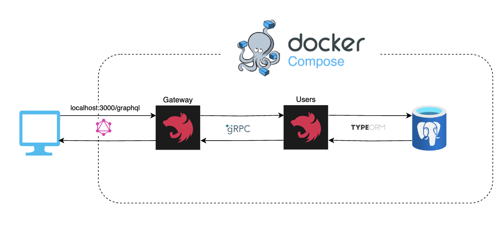

<p align="center">
  <a href="http://nestjs.com/" target="blank"></a>
</p>

[circleci-image]: https://img.shields.io/circleci/build/github/nestjs/nest/master?token=abc123def456
[circleci-url]: https://circleci.com/gh/nestjs/nest

## Description

Practice of [Nest-Monorepo](https://docs.nestjs.com/cli/monorepo), [GQL](https://graphql.org/), [GRPC](https://grpc.io/), [Postgresql](https://www.postgresql.org/)

## Architecture


## Running the app

```bash
# development
$ docker compose up --build
```

